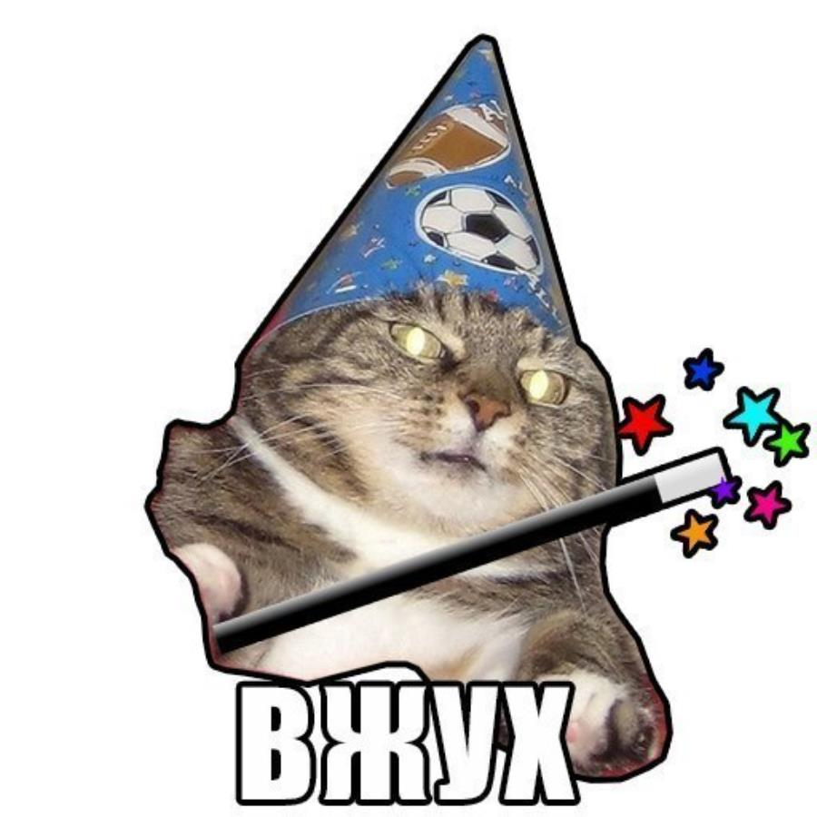
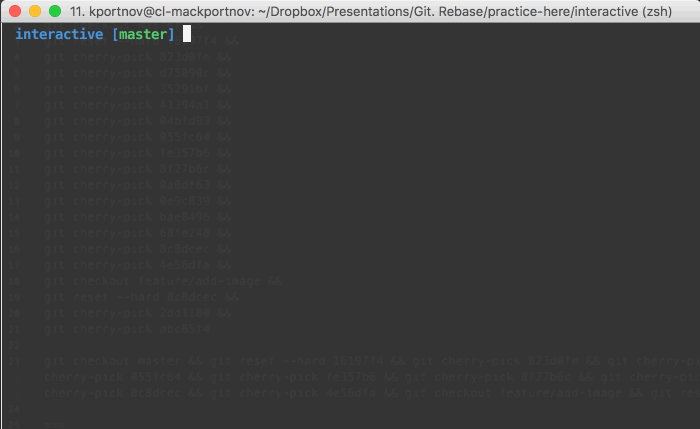

# [fit] Git: rebase
# [fit] From Chaos to Order

<br/>

```swift
let author = "Konstantin Portnov"
let github = "github.com/x0000ff"
```

<br/>


^ https://i.pinimg.com/736x/d8/f7/bc/d8f7bc72c1ca0361bb647eaffc501aed--yoda-images-movieposter.jpg

---

# What is git rebase?

---

# Feature branch is outdated...


---

# a little bit


---

# Change the base?
# "re-base"?
# 🤔

^ https://wac-cdn.atlassian.com/dam/jcr:e4a40899-636b-4988-9774-eaa8a440575b/02.svg?cdnVersion=iq

---

# Atlassian is liar!


^ https://cdn-images-1.medium.com/max/1600/1*mgyl38slmqmcE4STS56nXA.gif

---

# Atlassian fixed!


^ https://wuistalking.files.wordpress.com/2016/09/what-is-a-rebase.gif

---

# Let's do it!


---

# Magic is in progress



^ https://beatmaker.tv/Default/General/Image/f8b5c54e-c2f0-47f6-ba84-fc28c9edc0be?type=TrackImageOriginal&ver=0

---

# Result


---

# Result


---

# Practice

Feel free to practice in repo:
`./practice-here/rebase-simple`

---

# Can I have a conflict?


---

# `master`


---

# `feature`


---

# Let's try to rebase


---

# Oops


---

# Oops


---

# Oops


---

# Fix 


---

# Fix 


---

# Fixed


---

# I really love this cat


^ https://beatmaker.tv/Default/General/Image/f8b5c54e-c2f0-47f6-ba84-fc28c9edc0be?type=TrackImageOriginal&ver=0

---

# Fixed


---


# Practice

Feel free to practice in repo:
`./practice-here/rebase-conflict`

---

# Just replay commits?


---

# You can make it interactive 

```
$ git rebase --interactive HEAD~1

#################################

pick 0fcd976 Drop me

# Rebase b06684f..0fcd976 onto b06684f (1 command(s))
#
# Commands:
# p, pick = use commit
# r, reword = use commit, but edit the commit message
# e, edit = use commit, but stop for amending
# s, squash = use commit, but meld into previous commit
# f, fixup = like "squash", but discard this commit's log message
# x, exec = run command (the rest of the line) using shell
# d, drop = remove commit
```

---

# `pick`

> p, pick = use commit


---

# `reword`

> r, reword = use commit, but edit the commit message


---

# `edit`

> e, edit = use commit, but stop for amending

After make the changes you have to: 
- add changed file by "`git add`"
- continue rebase with command "`git rebase --continue`"

---

# `edit`

> e, edit = use commit, but stop for amending


---

# `squash`

> s, squash = use commit, but meld into previous commit



---

# `fixup`

> f, fixup = like "squash", but discard this commit's log message


---

# `exec`

> x, exec = run command (the rest of the line) using shell


---

# `exec` can be massive 😎

```
$ git rebase --interactive --exec "md5 README.md" HEAD~3
```


---

# `drop`

> d, drop = remove commit


---

# More info:

- https://git-scm.com/book/pt-br/v2/Git-Branching-Rebasing
- https://www.atlassian.com/git/tutorials/rewriting-history/git-rebase
- https://hackernoon.com/mastering-git-why-rebase-is-amazing-a954485b128a

---


# Q & A
# 🤔

---

# Thanks a lot!

☺️


---

# **Me...**


-  Konstantin Portnov 

-  [http://about.me/x0000ff](http://about.me/x0000ff)

-  [https://github.com/x0000ff](https://github.com/x0000ff)

-  [https://twitter.com/x0000ff](https://twitter.com/x0000ff)

-  [https://www.linkedin.com/in/KonstantinPortnov](https://www.linkedin.com/in/KonstantinPortnov)

---

# This Presentation
# 🙂
# http://bit.ly/2yuMmKC

---

# EOF
# 🍻